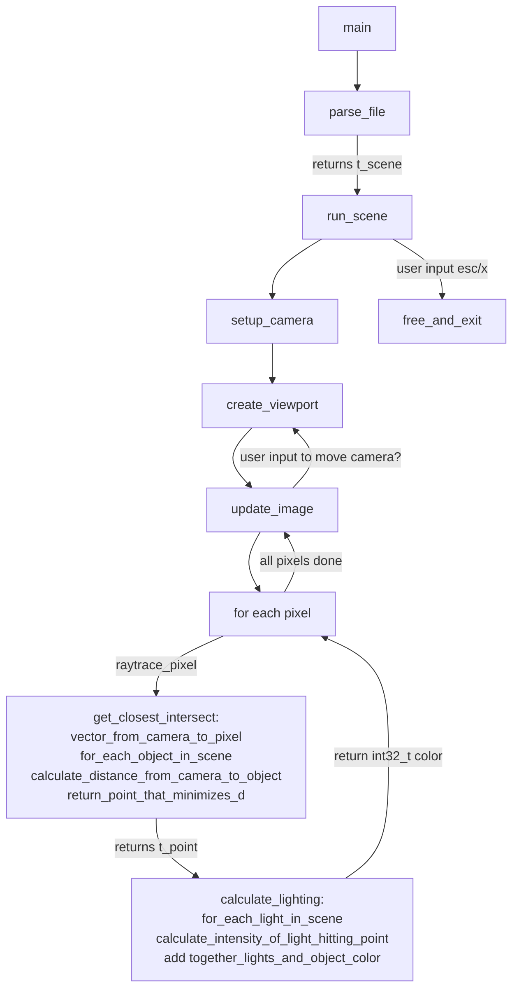

https://gabrielgambetta.com/computer-graphics-from-scratch/02-basic-raytracing.html
[[Basic Raytracing - Computer Graphics from Scratch]]

```mermaid
flowchart TD
    A[main] --> B[parse_file]
    B -->|returns t_scene| C[run_scene]
    C --> D[setup_camera]
    C -->|"user input esc/x"| L[free_and_exit]
    D --> E[create_viewport]
    E --> F[update_image]
    F --> G[for each pixel]
    G --> |raytrace_pixel| I["get_closest_intersect:<br>vector_from_camera_to_pixel<br>for_each_object_in_scene<br>calculate_distance_from_camera_to_object<br>return_point_that_minimizes_d"]
    I -->|returns t_point| J["calculate_lighting:<br>for_each_light_in_scene<br>calculate_intensity_of_light_hitting_point<br>add together_lights_and_object_color"]
    J --> |return int32_t color| G
    G -->|all pixels done| F
    F -->|user input to move camera?| E

```